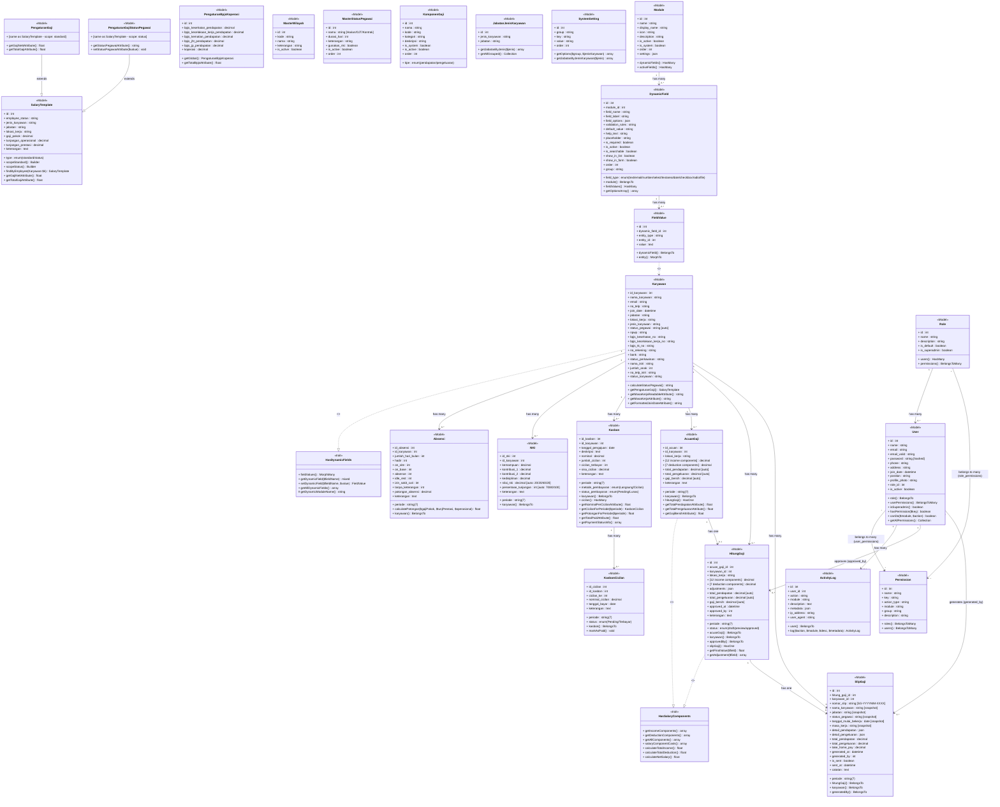

# Class Diagram — Payroll App

```mermaid
classDiagram
    class HasSalaryComponents {
        <<trait>>
        + getIncomeComponents() array
        + getDeductionComponents() array
        + getAllComponents() array
        + salaryComponentCasts() array
        + calculateTotalIncome() float
        + calculateTotalDeduction() float
        + calculateNetSalary() float
    }

    class HasDynamicFields {
        <<trait>>
        + fieldValues() MorphMany
        + getDynamicField($fieldName) mixed
        + setDynamicField($fieldName, $value) FieldValue
        + getAllDynamicFields() array
        # getDynamicModuleName() string
    }

    class Karyawan {
        <<Model>>
        + id_karyawan : int
        + nama_karyawan : string
        + email : string
        + no_telp : string
        + join_date : datetime
        + jabatan : string
        + lokasi_kerja : string
        + jenis_karyawan : string
        + status_pegawai : string [auto]
        + npwp : string
        + bpjs_kesehatan_no : string
        + bpjs_kecelakaan_kerja_no : string
        + bpjs_tk_no : string
        + no_rekening : string
        + bank : string
        + status_perkawinan : string
        + nama_istri : string
        + jumlah_anak : int
        + no_telp_istri : string
        + status_karyawan : string
        + calculateStatusPegawai() string
        + getPengaturanGaji() SalaryTemplate
        + getMasaKerjaReadableAttribute() string
        + getMasaKerjaAttribute() string
        + getFormattedJoinDateAttribute() string
    }

    class Absensi {
        <<Model>>
        + id_absensi : int
        + id_karyawan : int
        + periode : string(7)
        + jumlah_hari_bulan : int
        + hadir : int
        + on_site : int
        + on_base : int
        + absence : int
        + idle_rest : int
        + izin_sakit_cuti : int
        + tanpa_keterangan : int
        + potongan_absensi : decimal
        + keterangan : text
        + calculatePotongan($gajiPokok, $tunjPrestasi, $operasional) float
        + karyawan() BelongsTo
    }

    class NKI {
        <<Model>>
        + id_nki : int
        + id_karyawan : int
        + periode : string(7)
        + kemampuan : decimal
        + kontribusi_1 : decimal
        + kontribusi_2 : decimal
        + kedisiplinan : decimal
        + nilai_nki : decimal [auto: 20/20/40/20]
        + persentase_tunjangan : int [auto: 70/80/100]
        + keterangan : text
        + karyawan() BelongsTo
    }

    class Kasbon {
        <<Model>>
        + id_kasbon : int
        + id_karyawan : int
        + periode : string(7)
        + tanggal_pengajuan : date
        + deskripsi : text
        + nominal : decimal
        + metode_pembayaran : enum(Langsung/Cicilan)
        + status_pembayaran : enum(Pending/Lunas)
        + jumlah_cicilan : int
        + cicilan_terbayar : int
        + sisa_cicilan : decimal
        + keterangan : text
        + karyawan() BelongsTo
        + cicilan() HasMany
        + getNominalPerCicilanAttribute() float
        + getCicilanForPeriode($periode) KasbonCicilan
        + getPotonganForPeriode($periode) float
        + getTotalPaidAttribute() float
        + getPaymentStatusInfo() array
    }

    class KasbonCicilan {
        <<Model>>
        + id_cicilan : int
        + id_kasbon : int
        + cicilan_ke : int
        + periode : string(7)
        + nominal_cicilan : decimal
        + tanggal_bayar : date
        + status : enum(Pending/Terbayar)
        + keterangan : text
        + kasbon() BelongsTo
        + markAsPaid() void
    }

    class AcuanGaji {
        <<Model>>
        + id_acuan : int
        + id_karyawan : int
        + lokasi_kerja : string
        + periode : string(7)
        + [12 income components] : decimal
        + [7 deduction components] : decimal
        + total_pendapatan : decimal [auto]
        + total_pengeluaran : decimal [auto]
        + gaji_bersih : decimal [auto]
        + keterangan : text
        + karyawan() BelongsTo
        + hitungGaji() HasOne
        + getTotalPendapatanAttribute() float
        + getTotalPengeluaranAttribute() float
        + getGajiBersihAttribute() float
    }

    class HitungGaji {
        <<Model>>
        + id : int
        + acuan_gaji_id : int
        + karyawan_id : int
        + lokasi_kerja : string
        + periode : string(7)
        + [12 income components] : decimal
        + [7 deduction components] : decimal
        + adjustments : json
        + total_pendapatan : decimal [auto]
        + total_pengeluaran : decimal [auto]
        + gaji_bersih : decimal [auto]
        + status : enum(draft/preview/approved)
        + approved_at : datetime
        + approved_by : int
        + keterangan : text
        + acuanGaji() BelongsTo
        + karyawan() BelongsTo
        + approvedBy() BelongsTo
        + slipGaji() HasOne
        + getFinalValue($field) float
        + getAdjustment($field) array
    }

    class SlipGaji {
        <<Model>>
        + id : int
        + hitung_gaji_id : int
        + karyawan_id : int
        + periode : string(7)
        + nomor_slip : string [SG-YYYYMM-XXXX]
        + nama_karyawan : string [snapshot]
        + jabatan : string [snapshot]
        + status_pegawai : string [snapshot]
        + tanggal_mulai_bekerja : date [snapshot]
        + masa_kerja : string [snapshot]
        + detail_pendapatan : json
        + detail_pengeluaran : json
        + total_pendapatan : decimal
        + total_pengeluaran : decimal
        + take_home_pay : decimal
        + generated_at : datetime
        + generated_by : int
        + is_sent : boolean
        + sent_at : datetime
        + catatan : text
        + hitungGaji() BelongsTo
        + karyawan() BelongsTo
        + generatedBy() BelongsTo
    }

    class SalaryTemplate {
        <<Model>>
        + id : int
        + type : enum(standard/status)
        + employee_status : string
        + jenis_karyawan : string
        + jabatan : string
        + lokasi_kerja : string
        + gaji_pokok : decimal
        + tunjangan_operasional : decimal
        + tunjangan_prestasi : decimal
        + keterangan : text
        + scopeStandard() Builder
        + scopeStatus() Builder
        + findByEmployee(Karyawan $k) SalaryTemplate
        + getGajiNettAttribute() float
        + getTotalGajiAttribute() float
    }

    class PengaturanGaji {
        <<Model>>
        + [same as SalaryTemplate - scope: standard]
        + getGajiNettAttribute() float
        + getTotalGajiAttribute() float
    }

    class PengaturanGajiStatusPegawai {
        <<Model>>
        + [same as SalaryTemplate - scope: status]
        + getStatusPegawaiAttribute() string
        + setStatusPegawaiAttribute($value) void
    }

    class PengaturanBpjsKoperasi {
        <<Model>>
        + id : int
        + bpjs_kesehatan_pendapatan : decimal
        + bpjs_kecelakaan_kerja_pendapatan : decimal
        + bpjs_kematian_pendapatan : decimal
        + bpjs_jht_pendapatan : decimal
        + bpjs_jp_pendapatan : decimal
        + koperasi : decimal
        + getGlobal() PengaturanBpjsKoperasi
        + getTotalBpjsAttribute() float
    }

    class User {
        <<Model>>
        + id : int
        + name : string
        + email : string
        + email_valid : string
        + password : string [hashed]
        + phone : string
        + address : string
        + join_date : datetime
        + position : string
        + profile_photo : string
        + role_id : int
        + is_active : boolean
        + role() BelongsTo
        + userPermissions() BelongsToMany
        + isSuperadmin() boolean
        + hasPermission($key) boolean
        + canDo($module, $action) boolean
        + getAllPermissions() Collection
    }

    class Role {
        <<Model>>
        + id : int
        + name : string
        + description : string
        + is_default : boolean
        + is_superadmin : boolean
        + users() HasMany
        + permissions() BelongsToMany
    }

    class Permission {
        <<Model>>
        + id : int
        + name : string
        + key : string
        + action_type : string
        + module : string
        + group : string
        + description : string
        + roles() BelongsToMany
        + users() BelongsToMany
    }

    class MasterWilayah {
        <<Model>>
        + id : int
        + kode : string
        + nama : string
        + keterangan : string
        + is_active : boolean
    }

    class MasterStatusPegawai {
        <<Model>>
        + id : int
        + nama : string [Harian/OJT/Kontrak]
        + durasi_hari : int
        + keterangan : string
        + gunakan_nki : boolean
        + is_active : boolean
        + order : int
    }

    class KomponenGaji {
        <<Model>>
        + id : int
        + nama : string
        + kode : string
        + tipe : enum(pendapatan/pengeluaran)
        + kategori : string
        + deskripsi : string
        + is_system : boolean
        + is_active : boolean
        + order : int
    }

    class JabatanJenisKaryawan {
        <<Model>>
        + id : int
        + jenis_karyawan : string
        + jabatan : string
        + getJabatanByJenis($jenis) array
        + getAllGrouped() Collection
    }

    class SystemSetting {
        <<Model>>
        + id : int
        + group : string
        + key : string
        + value : string
        + order : int
        + getOptions($group, $jenisKaryawan) array
        + getJabatanByJenisKaryawan($jenis) array
    }

    class ActivityLog {
        <<Model>>
        + id : int
        + user_id : int
        + action : string
        + module : string
        + description : text
        + metadata : json
        + ip_address : string
        + user_agent : string
        + user() BelongsTo
        + log($action, $module, $desc, $metadata) ActivityLog
    }

    class Module {
        <<Model>>
        + id : int
        + name : string
        + display_name : string
        + icon : string
        + description : string
        + is_active : boolean
        + is_system : boolean
        + order : int
        + settings : json
        + dynamicFields() HasMany
        + activeFields() HasMany
    }

    class DynamicField {
        <<Model>>
        + id : int
        + module_id : int
        + field_name : string
        + field_label : string
        + field_type : enum(text/email/number/select/textarea/date/checkbox/radio/file)
        + field_options : json
        + validation_rules : string
        + default_value : string
        + help_text : string
        + placeholder : string
        + is_required : boolean
        + is_active : boolean
        + is_searchable : boolean
        + show_in_list : boolean
        + show_in_form : boolean
        + order : int
        + group : string
        + module() BelongsTo
        + fieldValues() HasMany
        + getOptionsArray() array
    }

    class FieldValue {
        <<Model>>
        + id : int
        + dynamic_field_id : int
        + entity_type : string
        + entity_id : int
        + value : text
        + dynamicField() BelongsTo
        + entity() MorphTo
    }

    %% === INHERITANCE ===
    PengaturanGaji --|> SalaryTemplate : extends
    PengaturanGajiStatusPegawai --|> SalaryTemplate : extends

    %% === TRAIT USAGE ===
    AcuanGaji ..|> HasSalaryComponents : <<use>>
    HitungGaji ..|> HasSalaryComponents : <<use>>
    Karyawan ..|> HasDynamicFields : <<use>>

    %% === ASSOCIATIONS ===

    %% Karyawan -> Payroll
    Karyawan "1" --> "0..*" Absensi : has many
    Karyawan "1" --> "0..*" NKI : has many
    Karyawan "1" --> "0..*" Kasbon : has many
    Karyawan "1" --> "0..*" AcuanGaji : has many
    Karyawan "1" --> "0..*" HitungGaji : has many
    Karyawan "1" --> "0..*" SlipGaji : has many

    %% Kasbon -> KasbonCicilan
    Kasbon "1" --> "0..*" KasbonCicilan : has many

    %% Salary Chain
    AcuanGaji "1" --> "0..1" HitungGaji : has one
    HitungGaji "1" --> "0..1" SlipGaji : has one

    %% RBAC
    Role "1" --> "0..*" User : has many
    Role "*" --> "*" Permission : belongs to many (role_permissions)
    User "*" --> "*" Permission : belongs to many (user_permissions)

    %% Activity
    User "1" --> "0..*" ActivityLog : has many

    %% Approval / Generation
    User "1" --> "0..*" HitungGaji : approves (approved_by)
    User "1" --> "0..*" SlipGaji : generates (generated_by)

    %% Dynamic Fields
    Module "1" --> "0..*" DynamicField : has many
    DynamicField "1" --> "0..*" FieldValue : has many
    FieldValue ..> Karyawan : <<morphTo>>
```
