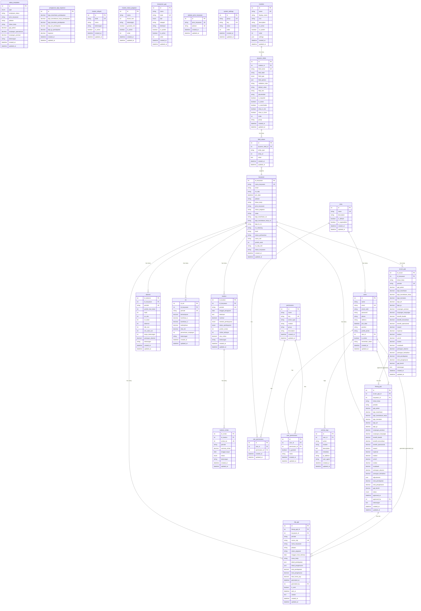

# ERD — Payroll App

```mermaid
erDiagram
    %% ============ CORE PAYROLL ============
    karyawan {
        int id_karyawan PK
        string nama_karyawan UK
        string email
        string no_telp
        datetime join_date
        string jabatan
        string lokasi_kerja
        string jenis_karyawan
        string status_pegawai
        string npwp
        string bpjs_kesehatan_no
        string bpjs_kecelakaan_kerja_no
        string bpjs_tk_no
        string no_rekening
        string bank
        string status_perkawinan
        string nama_istri
        int jumlah_anak
        string no_telp_istri
        string status_karyawan
        datetime created_at
        datetime updated_at
    }

    acuan_gaji {
        int id_acuan PK
        int id_karyawan FK
        string lokasi_kerja
        string periode UK
        decimal gaji_pokok
        decimal bpjs_kesehatan
        decimal bpjs_kecelakaan_kerja
        decimal bpjs_kematian
        decimal bpjs_jht
        decimal bpjs_jp
        decimal tunjangan_prestasi
        decimal tunjangan_konjungtur
        decimal benefit_ibadah
        decimal benefit_komunikasi
        decimal benefit_operasional
        decimal reward
        decimal koperasi
        decimal kasbon
        decimal umroh
        decimal kurban
        decimal mutabaah
        decimal potongan_absensi
        decimal potongan_kehadiran
        decimal total_pendapatan
        decimal total_pengeluaran
        decimal gaji_bersih
        text keterangan
        datetime created_at
        datetime updated_at
    }

    hitung_gaji {
        int id PK
        int acuan_gaji_id FK
        int karyawan_id FK
        string lokasi_kerja
        string periode
        decimal gaji_pokok
        decimal bpjs_kesehatan
        decimal bpjs_kecelakaan_kerja
        decimal bpjs_kematian
        decimal bpjs_jht
        decimal bpjs_jp
        decimal tunjangan_prestasi
        decimal tunjangan_konjungtur
        decimal benefit_ibadah
        decimal benefit_komunikasi
        decimal benefit_operasional
        decimal reward
        decimal koperasi
        decimal kasbon
        decimal umroh
        decimal kurban
        decimal mutabaah
        decimal potongan_absensi
        decimal potongan_kehadiran
        json adjustments
        decimal total_pendapatan
        decimal total_pengeluaran
        decimal gaji_bersih
        enum status
        datetime approved_at
        int approved_by FK
        text keterangan
        datetime created_at
        datetime updated_at
    }

    slip_gaji {
        int id PK
        int hitung_gaji_id FK
        int karyawan_id FK
        string periode
        string nomor_slip UK
        string nama_karyawan
        string jabatan
        string status_pegawai
        date tanggal_mulai_bekerja
        string masa_kerja
        json detail_pendapatan
        json detail_pengeluaran
        decimal total_pendapatan
        decimal total_pengeluaran
        decimal take_home_pay
        datetime generated_at
        int generated_by FK
        boolean is_sent
        datetime sent_at
        text catatan
        datetime created_at
        datetime updated_at
    }

    absensi {
        int id_absensi PK
        int id_karyawan FK
        string periode UK
        int jumlah_hari_bulan
        int hadir
        int on_site
        int on_base
        int absence
        int idle_rest
        int izin_sakit_cuti
        int tanpa_keterangan
        decimal potongan_absensi
        string keterangan
        datetime created_at
        datetime updated_at
    }

    nki {
        int id_nki PK
        int id_karyawan FK
        string periode UK
        decimal kemampuan
        decimal kontribusi_1
        decimal kontribusi_2
        decimal kedisiplinan
        decimal nilai_nki
        int persentase_tunjangan
        string keterangan
        datetime created_at
        datetime updated_at
    }

    kasbon {
        int id_kasbon PK
        int id_karyawan FK
        string periode UK
        date tanggal_pengajuan
        text deskripsi
        decimal nominal
        enum metode_pembayaran
        enum status_pembayaran
        int jumlah_cicilan
        int cicilan_terbayar
        decimal sisa_cicilan
        string keterangan
        datetime created_at
        datetime updated_at
    }

    kasbon_cicilan {
        int id_cicilan PK
        int id_kasbon FK
        int cicilan_ke UK
        string periode
        decimal nominal_cicilan
        date tanggal_bayar
        enum status
        string keterangan
        datetime created_at
        datetime updated_at
    }

    salary_templates {
        int id PK
        enum type
        string employee_status
        string jenis_karyawan
        string jabatan
        string lokasi_kerja
        decimal gaji_pokok
        decimal tunjangan_operasional
        decimal tunjangan_prestasi
        string keterangan
        datetime created_at
        datetime updated_at
    }

    pengaturan_bpjs_koperasi {
        int id PK
        decimal bpjs_kesehatan_pendapatan
        decimal bpjs_kecelakaan_kerja_pendapatan
        decimal bpjs_kematian_pendapatan
        decimal bpjs_jht_pendapatan
        decimal bpjs_jp_pendapatan
        decimal koperasi
        datetime created_at
        datetime updated_at
    }

    %% ============ MASTER DATA ============
    master_wilayah {
        int id PK
        string kode UK
        string nama
        string keterangan
        boolean is_active
        datetime created_at
        datetime updated_at
    }

    master_status_pegawai {
        int id PK
        string nama
        int durasi_hari
        string keterangan
        boolean gunakan_nki
        boolean is_active
        int order
        datetime created_at
        datetime updated_at
    }

    komponen_gaji {
        int id PK
        string nama
        string kode UK
        enum tipe
        string kategori
        string deskripsi
        boolean is_system
        boolean is_active
        int order
        datetime created_at
        datetime updated_at
    }

    jabatan_jenis_karyawan {
        int id PK
        string jenis_karyawan UK
        string jabatan UK
        datetime created_at
        datetime updated_at
    }

    system_settings {
        int id PK
        string group UK
        string key UK
        string value
        int order
        datetime created_at
        datetime updated_at
    }

    %% ============ RBAC ============
    users {
        int id PK
        string name
        string email UK
        string email_valid
        string password
        string phone
        string address
        datetime join_date
        string position
        string profile_photo
        int role_id FK
        boolean is_active
        string remember_token
        datetime created_at
        datetime updated_at
    }

    roles {
        int id PK
        string name UK
        string description
        boolean is_default
        boolean is_superadmin
        datetime created_at
        datetime updated_at
    }

    permissions {
        int id PK
        string name
        string key UK
        string action_type
        string module
        string group
        string description
        datetime created_at
        datetime updated_at
    }

    role_permissions {
        int id PK
        int role_id FK
        int permission_id FK
        datetime created_at
        datetime updated_at
    }

    user_permissions {
        int id PK
        int user_id FK
        int permission_id FK
        boolean is_granted
        string notes
        datetime created_at
        datetime updated_at
    }

    %% ============ DYNAMIC FIELDS ============
    modules {
        int id PK
        string name UK
        string display_name
        string icon
        string description
        boolean is_active
        boolean is_system
        int order
        json settings
        datetime created_at
        datetime updated_at
    }

    dynamic_fields {
        int id PK
        int module_id FK
        string field_name UK
        string field_label
        enum field_type
        json field_options
        string validation_rules
        string default_value
        string help_text
        string placeholder
        boolean is_required
        boolean is_active
        boolean is_searchable
        boolean show_in_list
        boolean show_in_form
        int order
        string group
        datetime created_at
        datetime updated_at
    }

    field_values {
        int id PK
        int dynamic_field_id FK
        string entity_type
        int entity_id
        text value
        datetime created_at
        datetime updated_at
    }

    %% ============ AUDIT ============
    activity_logs {
        int id PK
        int user_id FK
        string action
        string module
        text description
        json metadata
        string ip_address
        string user_agent
        datetime created_at
        datetime updated_at
    }

    %% ============ RELATIONSHIPS ============

    %% Karyawan -> Payroll (1:N)
    karyawan ||--o{ absensi : "has many"
    karyawan ||--o{ nki : "has many"
    karyawan ||--o{ kasbon : "has many"
    karyawan ||--o{ acuan_gaji : "has many"
    karyawan ||--o{ hitung_gaji : "has many"
    karyawan ||--o{ slip_gaji : "has many"

    %% Kasbon -> Cicilan
    kasbon ||--o{ kasbon_cicilan : "has many"

    %% Salary chain (1:1)
    acuan_gaji ||--o| hitung_gaji : "has one"
    hitung_gaji ||--o| slip_gaji : "has one"

    %% RBAC
    roles ||--o{ users : "has many"
    roles ||--o{ role_permissions : "has"
    permissions ||--o{ role_permissions : "has"
    users ||--o{ user_permissions : "has"
    permissions ||--o{ user_permissions : "has"

    %% Approval / Generation
    users ||--o{ hitung_gaji : "approves (approved_by)"
    users ||--o{ slip_gaji : "generates (generated_by)"

    %% Audit
    users ||--o{ activity_logs : "logs"

    %% Dynamic Fields
    modules ||--o{ dynamic_fields : "has many"
    dynamic_fields ||--o{ field_values : "has many"
    field_values }o--|| karyawan : "morphTo"
```
